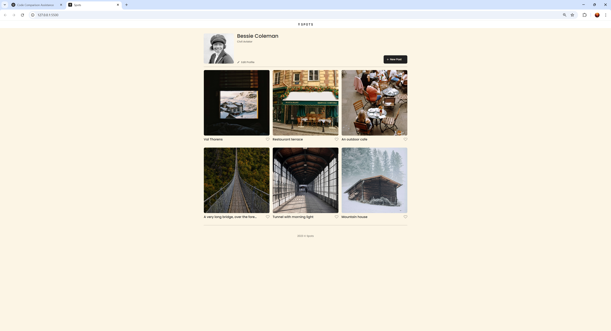
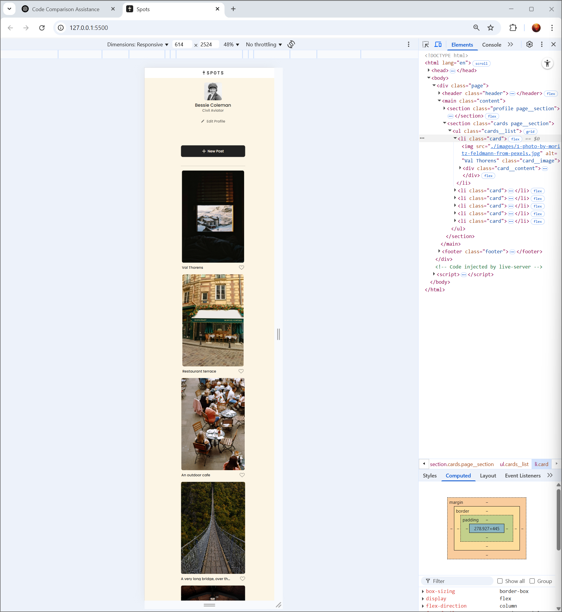

# Project 4 Spots

## Project Overview

This project is an adaptive webpage which can be viewed seamlessly across multiple devices of varying screen sizes. This website allows users to add and remove photos. Additionally, users can like photos and edit their profiles.

---

## Figma Design

[Link to the project on Figma](https://www.figma.com/file/BBNm2bC3lj8QQMHlnqRsga/Sprint-3-Project-%E2%80%94-Spots?type=design&node-id=2%3A60&mode=design&t=afgNFybdorZO6cQo-1)

---

## Technologies Used

- HTML5: Semantic and accessible structure
- CSS3: Grid, Flexbox, and media queries for responsive layouts
- GitHub Pages: For deploying the project
- JavaScript: DOM manipulation, event listeners, form handling

---

## Deployment

You can view the live project here:  
[Live Project on GitHub Pages](https://samantha-m-fernandez.github.io/se_project_spots/)

---

## Screenshots

### Desktop View

### Mobile View

---

## Project Walkthrough Video

[Watch the project walkthrough on Loom](https://www.loom.com/share/8eafdf1242874df7951ae16164899b16?sid=d0c799d8-2005-41ee-8a8e-a7e5d5cee986)
